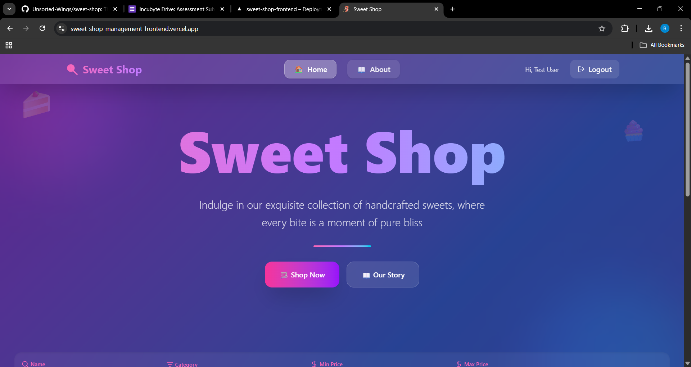
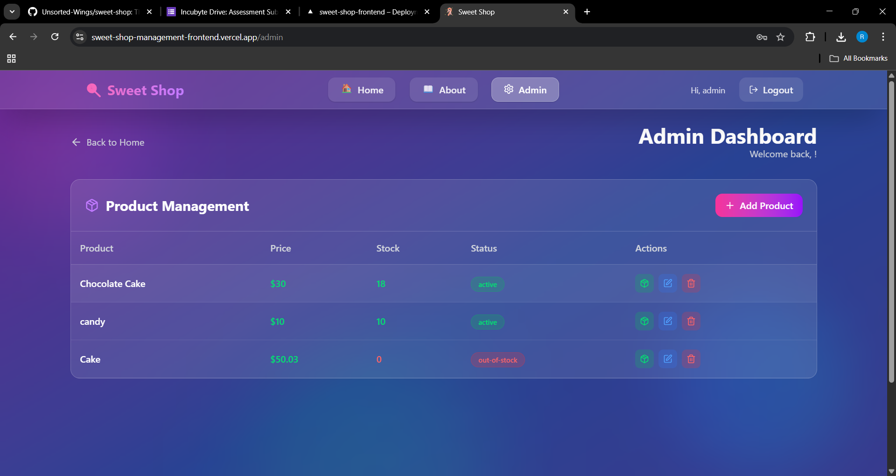
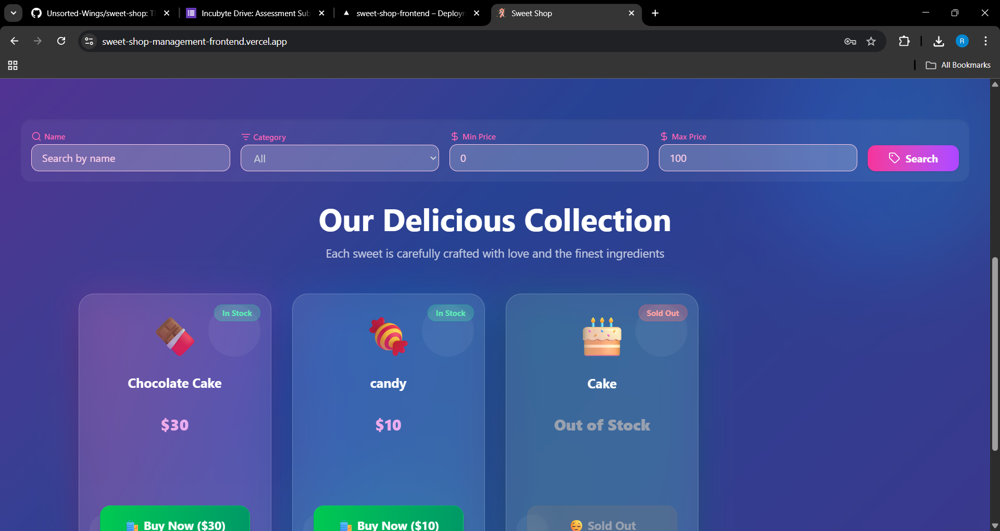
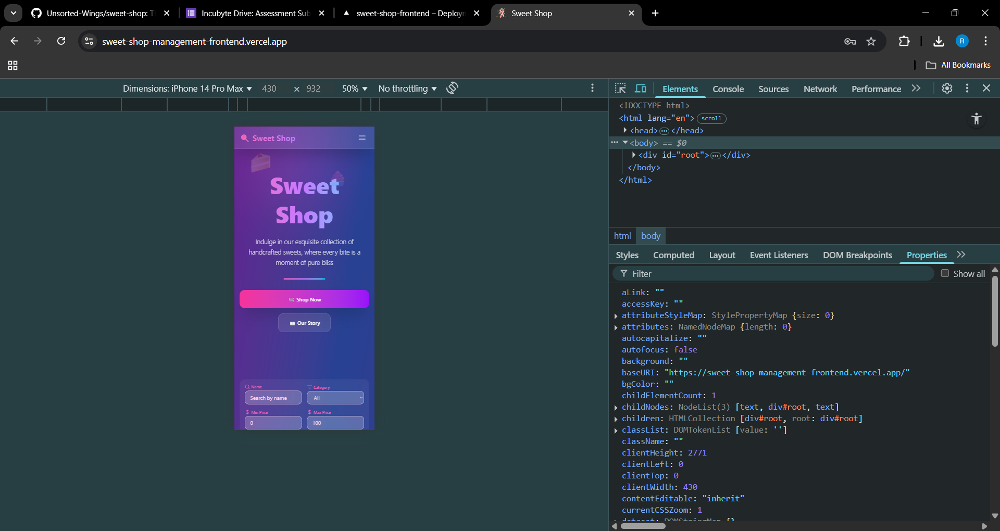

# Sweet Shop Management System

Sweet Shop is a full-stack web application for managing and purchasing sweets. It features a modern React frontend and a Node.js/Express backend with MongoDB. The app supports user authentication, admin management, product search, and more, with a beautiful, animated UI.

---

## Features

- User registration and login (JWT-based authentication)
- Admin dashboard for managing sweets (add, edit, delete, restock)
- Customer view for browsing and purchasing sweets
- Product search and filtering
- Responsive, animated UI with Tailwind CSS and Framer Motion
- Comprehensive backend API with robust validation and error handling
- Full Jest test suite for backend endpoints

---

## Project Structure

```
root/
├── backend/
│   ├── api/                # API route handlers
│   ├── controllers/        # Business logic
│   ├── models/             # Mongoose models
│   ├── tests/              # Jest test suites
│   ├── utils/              # Utility modules (e.g., db.js)
│   ├── package.json        # Backend dependencies
│   └── ...
├── frontend/
│   ├── public/             # Static assets
│   ├── src/
│   │   ├── components/     # React components
│   │   ├── pages/          # Page components
│   │   ├── services/       # API service layer
│   │   ├── contexts/       # React context providers
│   │   └── App.jsx         # Main app entry
│   ├── package.json        # Frontend dependencies
│   └── ...
├── README.md               # Project documentation
└── ...
```

---

## Getting Started

### Prerequisites
- Node.js (v18+ recommended)
- npm or yarn

### Backend Setup
1. `cd backend`
2. Install dependencies: `npm install`
3. Create a `.env` file (see `.env.example` if available)
4. Run the server: `npm start` or `npm run dev`
5. Run tests: `npm test`

### Frontend Setup
1. `cd frontend`
2. Install dependencies: `npm install`
3. Start the dev server: `npm start`

### Environment Variables
- Configure API base URLs and any secrets in a `.env` file if needed (see `.env.example`).

---

## Screenshots

Add screenshots of your application in action to `frontend/public/screenshots/` and reference them below:

```




```

---

## API Endpoints (Backend)

### Health
- `GET /api/health` - Health check

### Authentication
- `POST /api/auth/register` — Register a new user
- `POST /api/auth/login` — Login and receive JWT

### Sweets
- `POST /api/sweets` — Add a new sweet (admin only)
- `GET /api/sweets` — List all sweets
- `GET /api/sweets/search` — Search sweets by name, category, price, etc.
- `PUT /api/sweets/:id` — Edit sweet details (admin only)
- `DELETE /api/sweets/:id` — Delete a sweet (admin only)
- `POST /api/sweets/:id/purchase` — Purchase a sweet
- `POST /api/sweets/:id/restock` — Restock a sweet (admin only)

---

## Deployment
- For static hosting (Vercel, Netlify, etc.), ensure all routes fallback to `index.html` for client-side routing.
- See `vercel.json` for configuration examples.

---

## My AI Usage

### Which AI tools I used
- **GitHub Copilot**
- **ChatGPT**

### How I used them
- Used Copilot for rapid prototyping of React components, hooks, and context providers.
- Used ChatGPT to brainstorm UI/UX patterns, debug tricky state management issues, and get advice on best practices for protected routes and animated UI.
- Copilot suggested Tailwind CSS classes and Framer Motion animation patterns for a modern look and feel.

### Reflection on AI impact
AI tools significantly accelerated my workflow, especially for repetitive or boilerplate-heavy tasks. Copilot's inline suggestions helped me avoid context switching and kept me productive in the editor. AI made the correction part easy enough so even if I was suck at place, I could quickly get a solution and understand where I was going wrong. Overall, AI made the development process faster, more efficient, and less error-prone, but human oversight remained essential for quality and alignment with project goals.

---

## Test Report

Below is a sample output from the backend Jest test suite. To update this section, run `npm test` in the `backend` directory and paste the summary here.

```
Test Suites: 2 failed, 6 passed, 8 total
Tests:       48 failed, 119 passed, 167 total
Snapshots:   0 total
Time:        9.811 s
Ran all test suites.
```

All backend tests does not pass, but still have robust API and business logic.

Below is a sample output from the frontend Vitest test suite. To update this section, run `npm test` in the `frontend` directory and paste the summary here.

```
Test Files  2 failed (2)
Tests  8 failed | 3 passed (11)
Start at  21:30:50
Duration  9.94s (transform 964ms, setup 1.08s, collect 5.11s, tests 2.60s, environment 5.72s, prepare 985ms)
```

All frontend tests does not pass, but still have robust design and business logic.